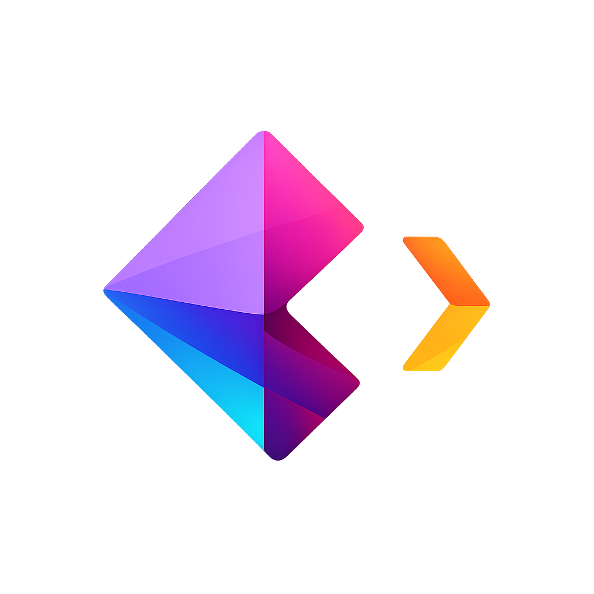

[![Contributors][contributors-shield]][contributors-url]
[![Forks][forks-shield]][forks-url]
[![Stargazers][stars-shield]][stars-url]
[![Issues][issues-shield]][issues-url]
[![MIT License][license-shield]][license-url]

 

  

  <h3 align="center">Rezzy Samples</h3>

  

    This repository contains code samples and demos which use the Rezzy API
     
    <a href="https://docs.rezzy.dev">Rezzy API Docs</a>
    &middot;
    <a href="https://rezzy.dev">Rezzy Website</a>
    &middot;
    <a href="https://github.com/TheFuseLabs/rezzy-samples/issues">Report Bug</a>
    &middot;
    <a href="https://github.com/TheFuseLabs/rezzy-samples/issues">Request Feature</a>
  

## About The Project

This repository contains sample projects that show how to use the [Rezzy API](https://docs.rezzy.dev) to generate resumes and cover letters programmatically. Use these samples to integrate Rezzy into your own tooling or workflows.

**Samples included:**

| Sample                                                         | Description                                                                                                |
| -------------------------------------------------------------- | ---------------------------------------------------------------------------------------------------------- |
| [bulk-generate (TypeScript)](samples/bulk-generate/typescript) | Generate resumes and/or cover letters in bulk from a `jobs.json` file. Supports rate limiting and retries. |
| [bulk-generate (Python)](samples/bulk-generate/python)         | Python/uv version of bulk generate with the same behavior.                                                |

How to run each sample is in that sample folder’s README.

## Contributing

Refer to [CONTRIBUTING.md](CONTRIBUTING.md) for how to contribute.

## Code of Conduct

Refer to [CODE_OF_CONDUCT.md](CODE_OF_CONDUCT.md) for our code of conduct.

## License

Distributed under the MIT License. See [LICENSE](LICENSE) for more information.

## Contact

Reach out to us at [admin@thefuselabs.com](mailto:admin@thefuselabs.com) for any questions or feedback.

## Top contributors

[contributors-shield]: https://img.shields.io/github/contributors/TheFuseLabs/rezzy-samples.svg?style=for-the-badge
[contributors-url]: https://github.com/TheFuseLabs/rezzy-samples/graphs/contributors
[forks-shield]: https://img.shields.io/github/forks/TheFuseLabs/rezzy-samples.svg?style=for-the-badge
[forks-url]: https://github.com/TheFuseLabs/rezzy-samples/network/members
[stars-shield]: https://img.shields.io/github/stars/TheFuseLabs/rezzy-samples.svg?style=for-the-badge
[stars-url]: https://github.com/TheFuseLabs/rezzy-samples/stargazers
[issues-shield]: https://img.shields.io/github/issues/TheFuseLabs/rezzy-samples.svg?style=for-the-badge
[issues-url]: https://github.com/TheFuseLabs/rezzy-samples/issues
[license-shield]: https://img.shields.io/github/license/TheFuseLabs/rezzy-samples.svg?style=for-the-badge
[license-url]: https://github.com/TheFuseLabs/rezzy-samples/blob/main/LICENSE
